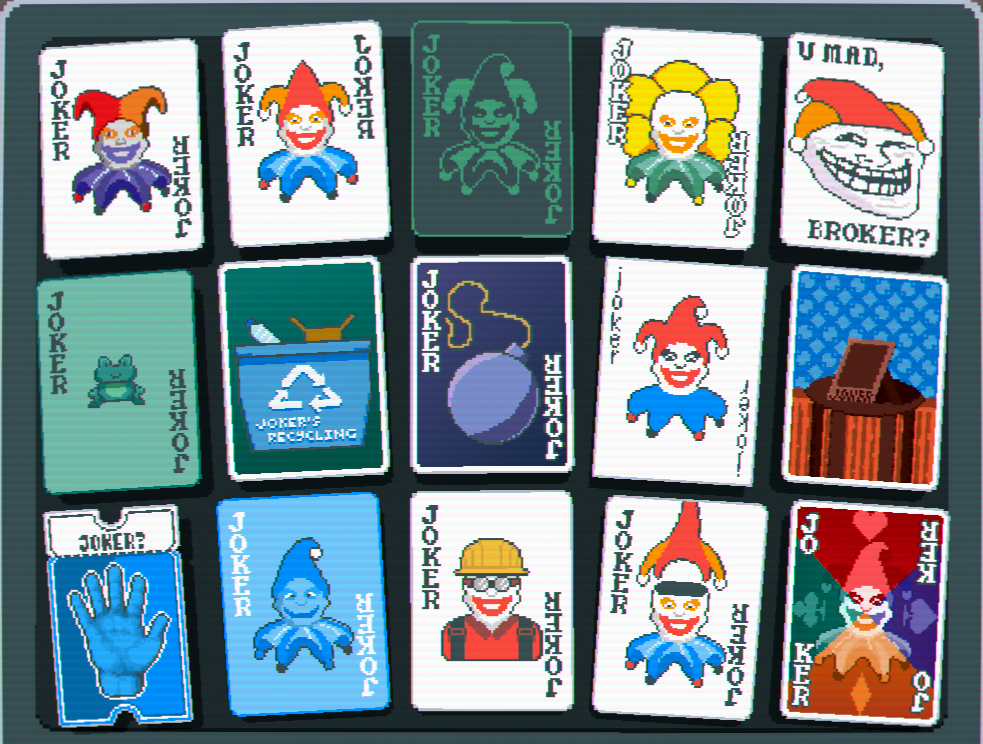
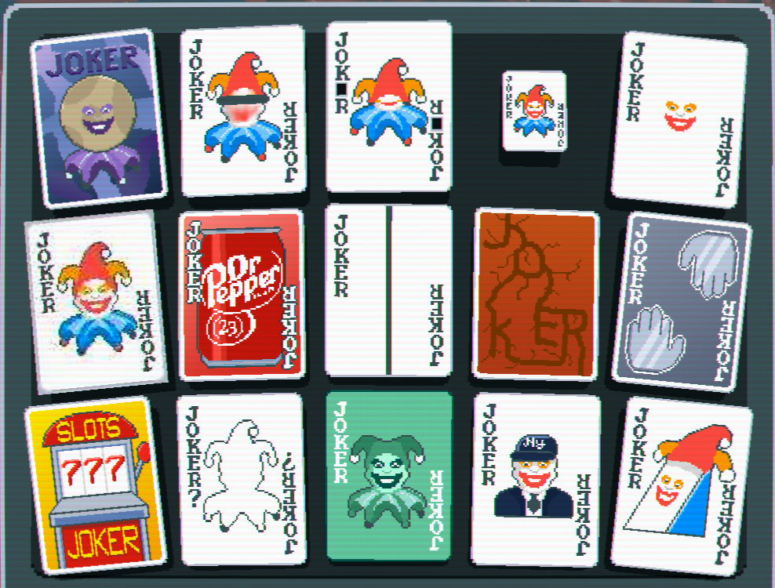
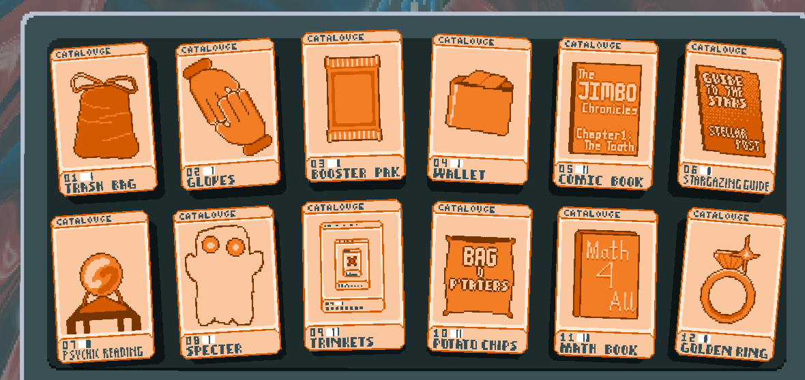

# Jokes Of A Feather || Doctor Ducko

## A Balatro Mod adding a whole buncha stuffs

# Overview
Jokes of a Feather adds new Jokers, Decks, Enhancements, Seals, and a whole new Consumable type (Trinkets) to Balatro!

Currently added:
* 45 Jokers
    * 12 Common
    * 16 Uncommon
    * 8 Rare
    * 3 Legendary
    * 6 Family Guy
* 4 Decks
* 5 Tarot Cards
* 5 Spectral Cards
* 12 Trinket Cards
* 2 Vouchers
* 5 Enhancements
* 4 Seals
* 4 Booster Packs

# Requirements
* [Steammodded](https://github.com/Steamodded/smods)
* [Talisman](https://github.com/SpectralPack/Talisman)

# Credits
## Doctor Ducko
* Programmer, Artist
## Chilli
* Ideas
## Hydrop0x
* Ideas
## The Several Public Resources for code refrences
* [Example mods from the wiki](https://github.com/Steamodded/examples/tree/master/Mods)
* [Vanilla Remade by nh6574](https://github.com/nh6574/VanillaRemade)