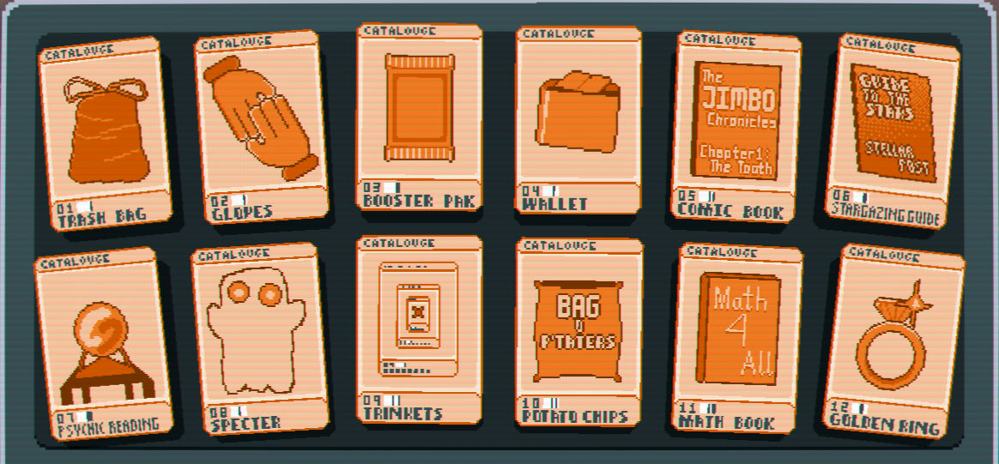

# Jokes Of A Feather || Doctor Ducko

## A Balatro Mod adding a whole buncha stuffs

## Overview
Jokes of a Feather adds new Jokers, Decks, Enhancements, Seals, and a whole new Consumable type (Trinkets) to Balatro!

Currently added:
* 45 Jokers
    * 12 Common
    * 16 Uncommon
    * 8 Rare
    * 3 Legendary
    * 6 Family Guy
* 4 Decks
* 5 Tarot Cards
* 5 Spectral Cards
* 12 Trinket Cards
* 2 Vouchers
* 5 Enhancements
* 4 Seals
* 4 Booster Packs

# Additions
## Jokers
### Common
Joker?
* +50 chips

JokerekoJ
* Scores bonus chips according to the base value of the scored card

Binary Joker
* +8 Mult if playec card is an Ace or a 2

Sunflower Joker
* Earn $1 when the round ends, increases by 1 when the round ends, maxes out at $5

Irritating Joker
* Scored cards in the first played hand of round gain +9.9 bonus chips when scored

Frug
* +1 Joker slot and +5 Mult
* +1 Mult per copy and +X0.5 Mult per 5 copies
* Multiple copies can appear in the shop

Recycling Bin
* Gain $1 every 5 cards discarded

Long Fuse
* Dynamite Cards have a 1 in 4 chance of not losing a turn

Simple Joker
* +3 Mult if scored card is not a face card

Picture Frame
* First played number card gives X2 chips when scored

Misplaced
* Gain +1 Hand per round

Abundant Joker
* Scores +40 chips for every Common Joker you have (including itself)

### Uncommon
Tinkerer Joker
* Create a random Trinket card at the start of a blind

Brainless Joker
* Gains +X0.5 Mult when a Dynamite Card explodes

Colorful Joker
* Retrigger all scored cards of a specific suit, changes at the end of the round

Lunar Joker
* +2 Mult per level on all discovered poker hands

The Witness
* No cards are considered face cards
* Has a higher priority than Paredolia

Jokr
* +20 Mult if the scored card does not contain an "E" in it's name or number

Lil' Joker
* Scores the chips and Mult that High Card currently has

Joker Face
* When round begins, add a random face card to your deck

jimbo.jpg
* Scored cards lose 1 chip and gain +1 bonus Mult when scored

Dr. Pepper
* +50 Mult, -5 Mult per round

Straight Line
* Gains X0.2 Mult if played hand contains a Straight

Square Roots
* Played Aces, 4s, and 9s score X1.5 Mult

Hands of Steel
* Scored Steel Cards give X1.5 Chips

Slot Machine
* Scored 7's have a 1 in 7 chance to score $20

M.I.A Joker
* +1 Joker Slot
* (Scores a random effect)

Novel Joker
* Scores +7 Mult for every Uncommon Joker you have (including itself)

### Rare
Comedian
* Upgrades a random stat by a random amount when a random poker hand is played

Jramp
* Gives X-Mult equal to half of the current Ante unless Ante is less than 2

Card Belt
* +6 hand size, -2 hands per round

57 Leaf Clover
* Triples all listed probabilities

Joker Energy
* Gains X0.2 Mult after every round, Self-destructs at X3 Mult

Photographer
* Gains bonus chips according to the base chip value of a scored card

EVIL Joker
* If scored hand is a Three of a Kind with 3 6's, gain X6 Mult

Precious Joker
* Scores an extra X0.5 Mult for every Rare Joker you have, starting at X1 Mult

### Legendary
Emperor
* Gives ^0.02 Mult for each round played

Money Smart
* Gives X0.25 Mult for each $5 owned

Flug
* X4 chips and X4 Mult, Gain 1 discard and set hands to 1 when Blind is selected

### Family Guy
Peter Griffin
* X5 Mult

Lois Griffin
* Earn $10 when the round ends

Chris Griffin
* +3 Joker slots

Meg Griffin
* All Heart cards score +100 chips

Stewie Griffin
* Levels up the played hand by 1

Brian Griffin
* Increases Mult by 0.5 for every card discarded

## Decks
Tinkerer's Deck
* Start with a Tinkerer Joker, +2 consumable slots

Glimmering Deck
* Start run with all Gold Cards, Earn no Interest
* Credit: Chilli

Hiker's Deck
* Start with Overstock, Crystal Ball, Seed Money, and Paint Brush. +2 Joker slots, hands, and discards, Winning Ante is 16

Family Deck
* Start with all Eternal Family Jokers, -1 Joker slot, -2 hands, -1 discard, X8 base Blind Size, Earn no Interest

## Consumables
### Tarot Cards
The Balance
* Enhances 2 cards into Combo Cards

The Legacy
* Enhances 1 card into a Stained Card

The Explosion
* Enhances 2 cards into Dynamite Cards

The Feather
* Enhances 3 cards into Lightweight Cards

The Flip
* Enhances 1 card into a Swap Card

### Spectral Cards
Multiply
* Select 1 card to apply Pink Seal to

Recreate
* Select 1 card to apply Navy Seal to

Development
* Select 1 card to apply Orange Seal to

Chance
* Select 2 cards to apply Lucky Seal to

### Trinket Cards
Trash Bag
* +2 Discards in a round

Gloves
* +2 hands in a round

Wallet
* Gain between $2 and $8

Comic Book
* Create a random Joker

Stargazing Guide
* Create a random Planet

Psychic Reading
* Create a random Tarot

Specter
* Create a random Spectral

Trinkets
* Create a random Trinket

Potato Chips
* Add +10 permanent chips to 3 cards

Math Book
* Add +3 permanent Mult to 2 cards

Golden Ring
* Add +$2 permanently to 2 cards

## Enhancements
Combo Card
* +20 chips and +3 Mult

Stained Card
* X1.5 chips

Dynamite Card
* X2.5 Mult, destroyed after 3 hands

Lightweight Card
* +30 Chips, always scores

Swap Card
* Swaps chips and Mult

## Seals
Pink Seal
* X2 Mult on score

Navy Seal
* Create a Spectral Card on discard

Orange Seal
* Create a Trinket Card when scored

Lucky Seal
* 1 in 5 chance for +20 Mult
* 1 in 3 chance for +30 chips
* 1 in 15 chance for 2 retriggers

# Credits
## Doctor Ducko
* Programmer, Artist
## Chilli
* Ideas
## Hydrop0x
* Ideas
## The Several Public Resources for code refrences
* Example mods from the wiki
* Vanilla Remade by nh6574 and the-Astra on github